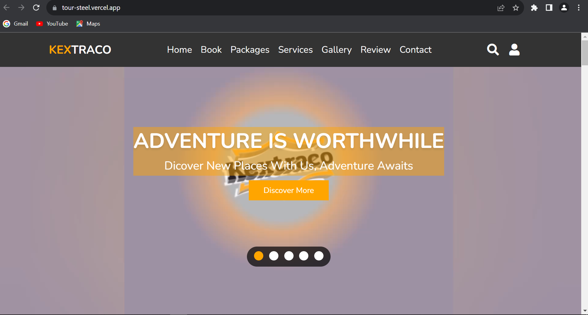

# Tour

# Tour Site Readme




## Project Overview
I'm not just building websites; I'm contributing to a digital ecosystem that connects and empowers users globally. The endless possibilities of code inspire me, and the collaborative spirit of the frontend community motivates me to push boundaries.
The beauty lies not just in pixels but in the harmony of user interaction, where every click and scroll tells a story.

## Challenges and Resilience

Frontend development isn't just about pixels and layouts; it's a dynamic fusion of creativity and problem-solving. It's about bringing designs to life and creating digital experiences that resonate.

With each line of code, I'm dedicated to not just meeting but exceeding user expectations, ensuring every interaction is intuitive and delightful. I find my rhythm. It's about more than just syntax; it's about crafting a symphony of elements that resonate with users. The canvas may be virtual, but the impact on users is very real.


## Table of Contents

1. [Getting Started](#getting-started)
2. [Features](#features)
3. [Usage](#usage)
4. [Contributing](#contributing)

## Getting Started

To explore our Food Site, simply visit [Food Site Demo](https://tour-steel.vercel.app).

## Features

- **Interactive Exploration:** Engage users with an interactive map and detailed information about destinations.

- **User-Friendly Booking:** Streamline reservations with an intuitive booking system, allowing customization of itineraries.

- **Customer Reviews:** Build trust with a review system, featuring testimonials and ratings from satisfied travelers.


## Contributing

If you want to contribute to our Food Site project, follow these steps:

1. Fork the repository to your GitHub account.

2. Clone the forked repository to your local machine:

   ```
   git clone https://github.com/yourusername/food-site.git
   ```

3. Create a new branch for your changes:

   ```
   git checkout -b feature/your-feature
   ```

4. Make your changes and commit them with descriptive commit messages.

5. Push your changes to your fork on GitHub:

   ```
   git push origin feature/your-feature
   ```

6. Create a pull request on the original repository to propose your changes.


Enjoy Streamline reservations with an intuitive booking system! If you have any questions or feedback, feel free to contact the project maintainers.
